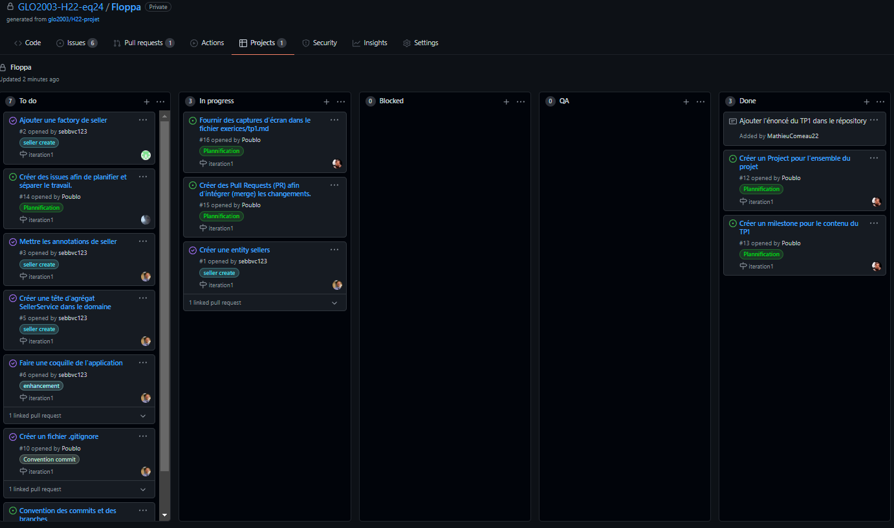
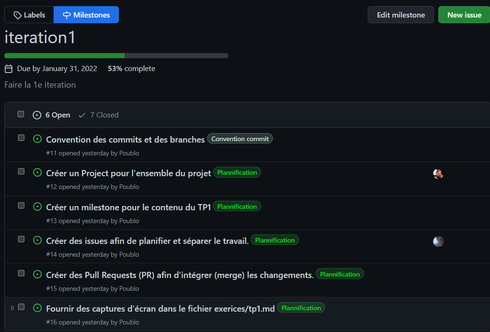
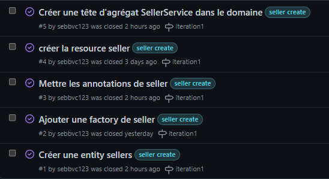
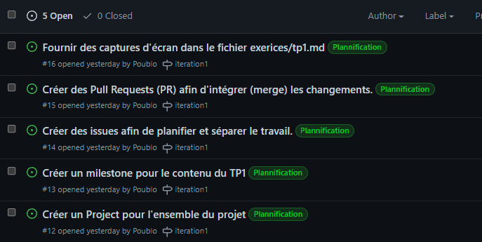

# TP1
##Project Floppa

##Milestone

##Issues
###Seller

###Planification

##Pull Requests

#à delete du rapport ->
##SCREENSHOT À AVOIR :
* 1 pour le Project comprenant les colonnes et les issues associées
* 1 pour le milestone comprenant le titre, la description et les issues associées
* 3 pour les issues avec tous les éléments demandés visibles
* 3 pour les PR avec tous les éléments demandés visibles