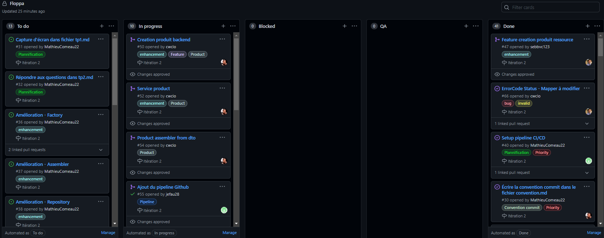
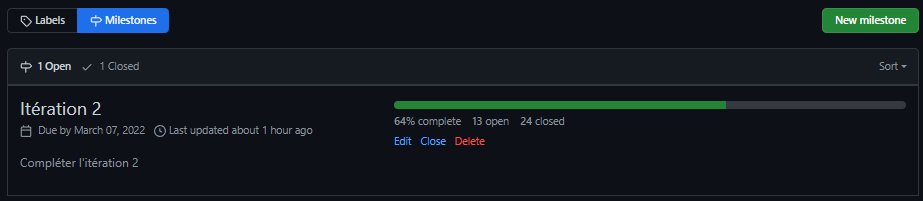
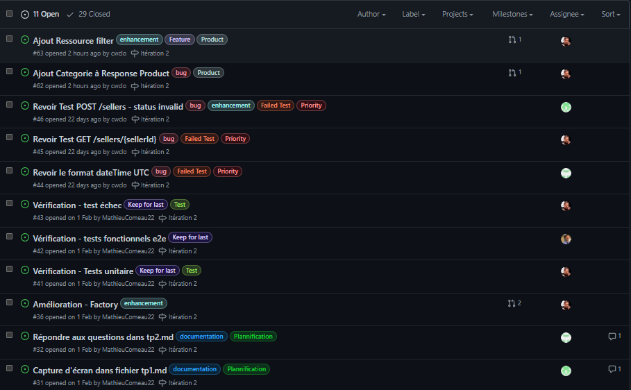
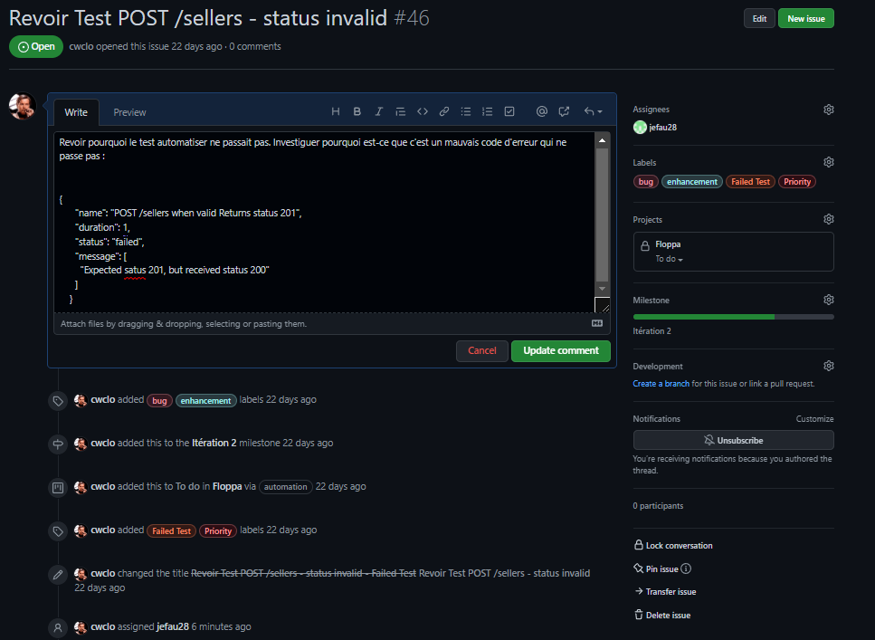
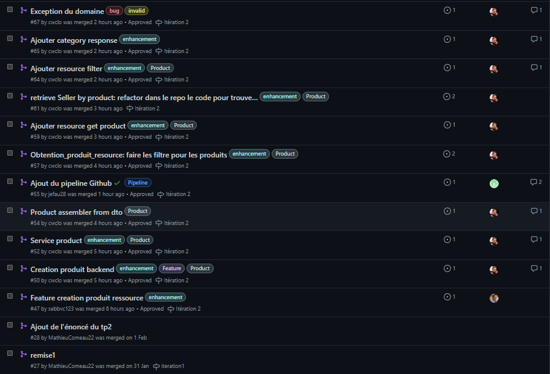
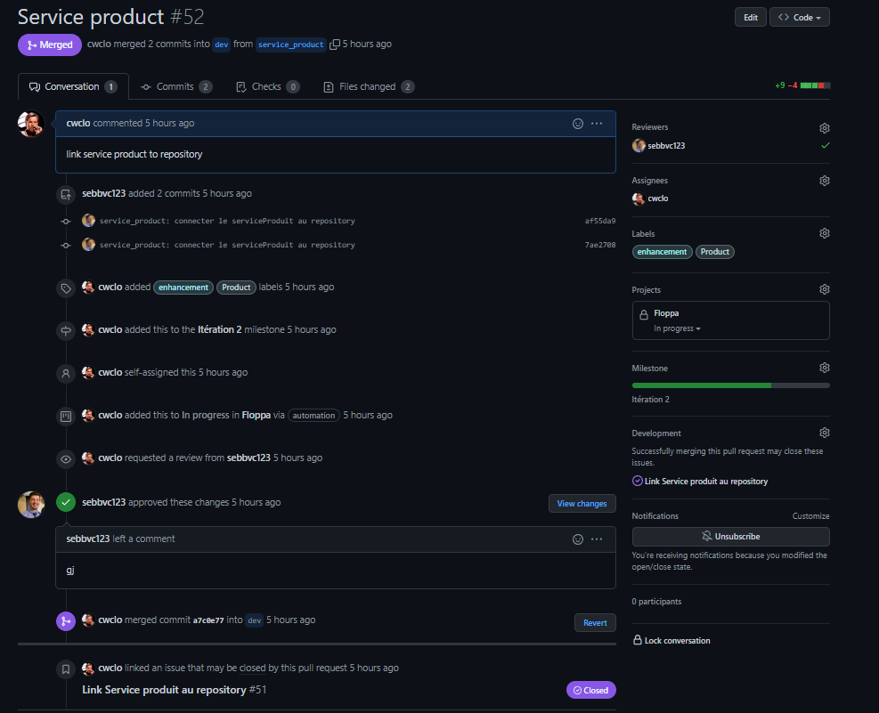
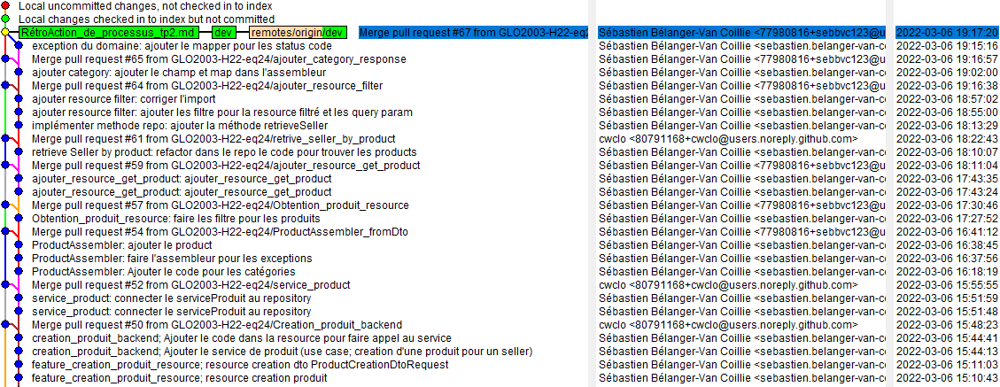

# TP2

# Planification du travail sur Github

L'ensemble de votre travail doit être documenté et planifier sur Github Project en respectant les meilleures pratiques de développement et de processus logiciel. Vous devez donc :

1. *Project* 

2. Créer un *milestone* pour le contenu du TP2

3. Créer des issues afin de planifier et séparer le travail. 
    
   
   

4. *Pull Requests* (PR)  
     
        
5. **Nouveau!** Décidez d'une stratégie de commits et de branches afin d'uniformiser et optimiser votre processus.
   1. Voir Section : ***Convention des commits***
   2. 

Afin de vous évaluer, **vous devez fournir ces captures d'écran** dans le fichier `exerices/tp2.md` :

- **1** pour le ***Project*** comprenant les colonnes et les issues associées
- **1** pour le ***milestone*** comprenant le titre, la description et les issues associées
- **3** pour les **issues** avec tous les éléments demandés visibles
- **3** pour les **PR** avec tous les éléments demandés visibles
- **Nouveau!** **1** pour votre **arbre de commits et de branches** (au moins 3 branches et/ou 10 commits visibles)

**Vos captures d'écran doivent être cohérentes et prise à un moment fixe de votre développement**.

# CONVENTION DES COMMITS

## Faire de petits commits à usage unique
En ne validant que de petites sections de code, tous les membres de l'équipe peuvent rapidement comprendre quel travail a été effectué. En cas de problème, des commits plus petits facilitent l'annulation des mauvais enregistrements, ce qui aide à maintenir une base de code stable.

Il est plus facile de comprendre le code soumis lorsque seules les modifications associées sont archivées. Si vous corrigez deux bogues distincts, il devrait y avoir deux commits distincts.

## Nom des commits

Chaque nom de commit doit inclure :

* Nom de la branche courante des modifications
* Nom de la feature touchée par les modifications
* Description sommaire des modifications (nom de méthode ou autre information pertinante)
    * EX : dev - product - GET /Product

## Rédaction des messages de validation courts et détaillés

Un message de validation  devrait :
* commencer par un bref résumé de la modification.
* être rédigé au présent
* ligne d'objet limitée  à 50 caractères
* avoir deuxième ligne vide pour séparer la ligne d'objet du message pour garantir que seule la ligne d'objet s'affiche

Assurez-vous de fournir suffisamment de détails pour répondre :

* Qu'est-ce qui a changé depuis la dernière version ?
* Comment a-t-il résolu le problème ?
* Pourquoi avez-vous fait le changement ?

### Voici quelques mauvais exemples :

* Adresse de l'élément de travail xxxyyy.
* Correction d'un bogue.
* X et Y refactorisés. Fichiers ajoutés.
* Qui a cassé ce code ?????

# Rétrospective sur le processus

##Liste de métriques importantes à mesurer pour démarrer la réflexion :

1. Combien de temps (moyenne, minimum, maximum) votre équipe prenait-elle pour implémenter une issue?
   1. Minimum: 20 sec
   2. Maximum : 1min
   3. Moyenne : Max+Min / 2 = 40 secondes

    
3. Combien de temps (moyenne, minimum, maximum) votre équipe prenait-elle pour intégrer une pull-request? (review + correctifs)
   1. Minimum : 10 sec
   2. Maximum :  3 minutes (180 secondes)
   3. Moyenne : 95 secondes (1min35 secondes)

4. Combien de personnes (moyenne, minimum, maximum) travaillaient sur chaque issue? (individuel, paire, équipe, etc.)
   1. Minimum : 2 personnes
   2. Maximum : 2 personnes
   3. Moyenne : 2 personnes
5. Combien de personnes (moyenne, minimum, maximum) *reviewaient* chaque pull-request?
   1. Minimum : 2 personnes
   2. Maximum : 3 personnes
   3. Moyenne : 2 personnes
6. Combien d'issue (moyenne, minimum, maximum) étaient en cours d'implémentation en même temps?
   1. Minimum: 2 issues
   2. Maximum :4 issues
   3. Moyenne :3 issues

7. Combien de pull-requests (moyenne, minimum, maximum) étaient en cours de review en même temps?
   1. Minimum : 1 PR
   2. Maximum : 3 PR
   3. Moyenne :  2 PR

Après avoir mesuré ces métriques, voici les réfléxions que vous devez poser en équipe et écrire dans le fichier `tp2.md` :

1. Selon vous, est-ce que les issues/pull-requests prenaient trop de temps à être terminées? Ou pas assez? Quel serait le temps idéal (approximatif) pour chacun?
   1. Selon les métriques observées, on peut dire que les PR ne prenaient pas assez de temps à être terminées.Il est vrai de dire que la majorité de nos PR étaient faites en directe.Une moyenne de temps de moins de 2minutes pour intégrer une pull-request est vraiment faible. Du code que l'équipe est prête à pousser sur la branche principale devrait nécéssiter plus de temps et plus d'attention. Cependant, la majorité des PR de l'équipe était très limitée en changement, ce qui facilitait le travail du "Reviewer". Les issues étaient assez brèves également autant sur le volet création que le volet exécution. 
2. Quel est le lien entre la taille de ces issues/pull-requests et le temps que ça prenait à les terminer?
   1. Plus une issues est détaillées et plus elle est spécifique, plus cette issues est rapide à effectuer et à se terminer. En équipe, on a observé que les issues qui prenaient le plus de temps à se réaliser étaient celles qui étaient les moins bien détaillées et qui étaient trop complexes. 
3. Donnez au moins 3 trucs pour améliorer votre processus (tailles des issues/pr, communication, code reviews, uniformisation, etc.)
   1. Prendre le temps de décrire les issues et quels en sont les objectifs et critères d'acceptation.
   2. Utiliser le temps nécessaire pour la revue du code, quitte à attendre la venue d'un membre de l'équipe qui n'a pas vue ou touchée au code visé par une PR
   3. En cas de besoin (complexité et requis mal définis), prendre le temps nécessaire pour définir les issues .
   4. S'engager en équipe à adopter de meilleure communication du genre :
      1. Aviser lorsqu'une nouvelle PR est disponible pour une revue
      2. Donner des commentaires sur chaque revue
      3. Poser des questions sur le code visée par les PR. Si on ne comprend pas le code implémenter, c'est peut être que cela ne respecte pas le Clean Code.