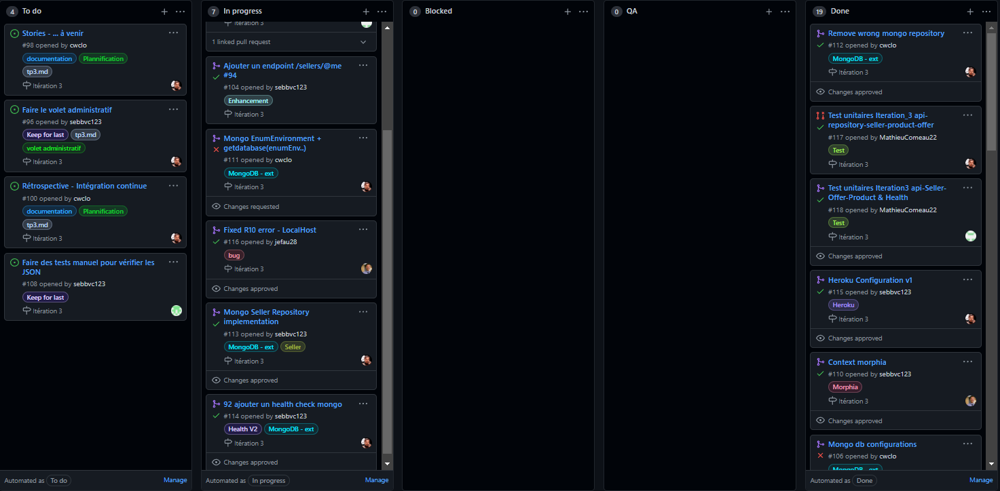
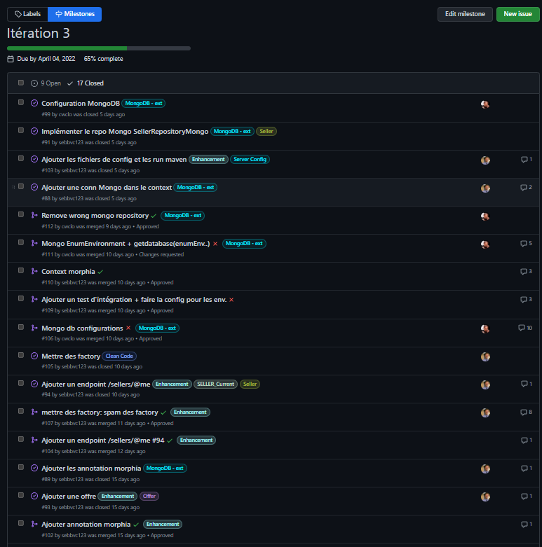
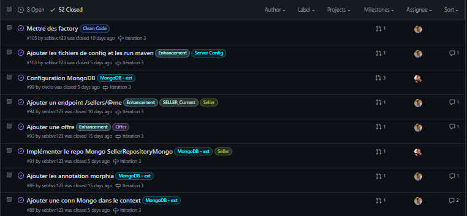
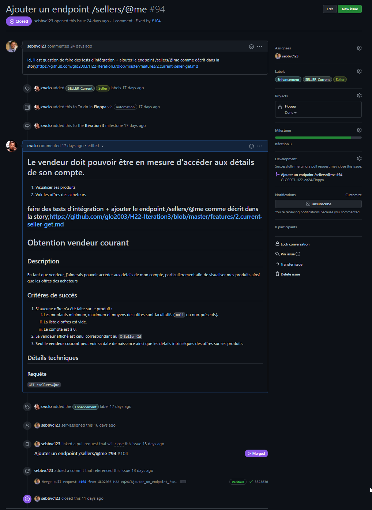
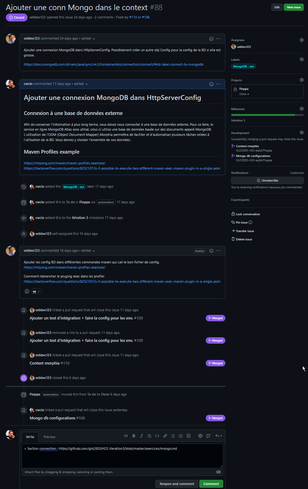
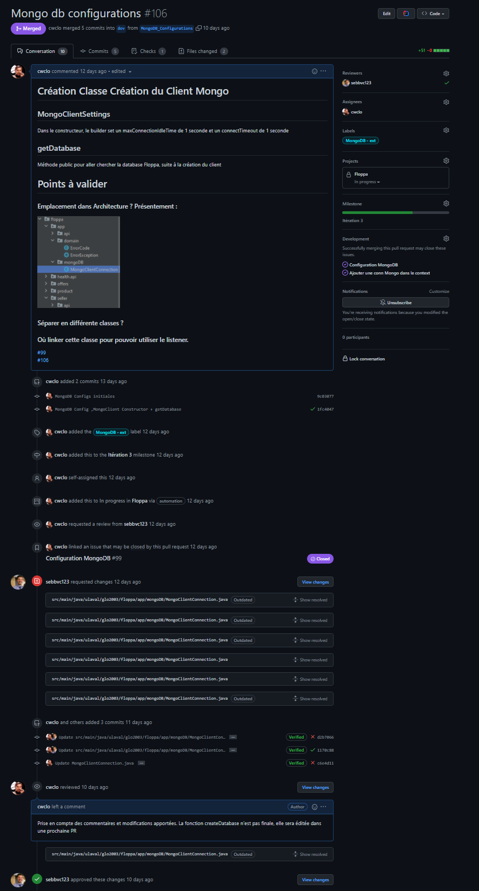
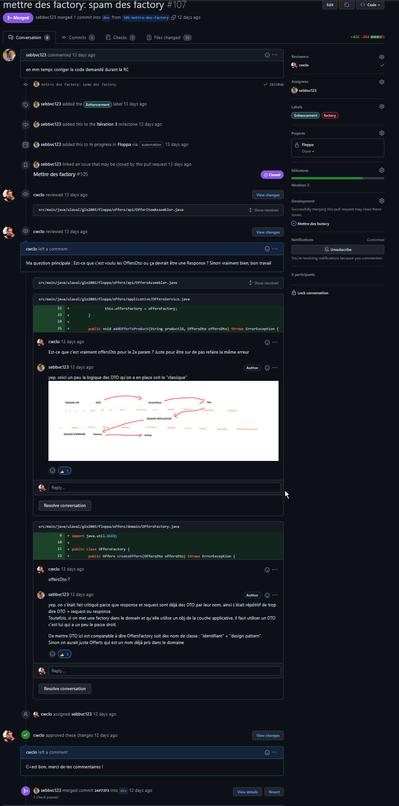
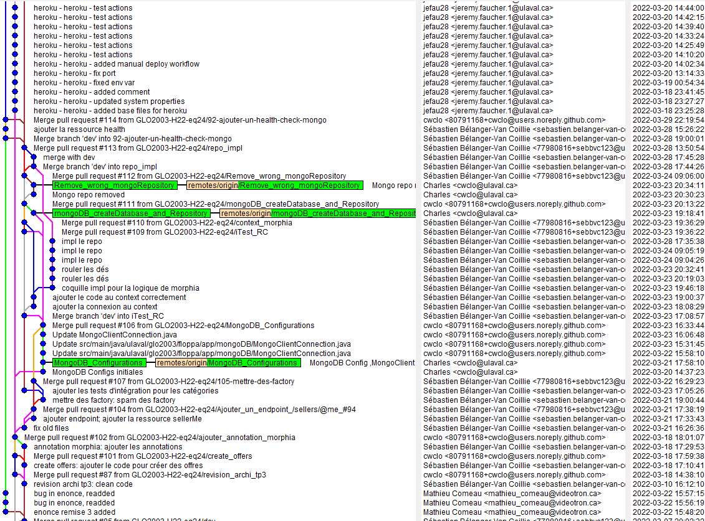

# TP3
# Planification du travail sur Github
## Project

## Milestone

## Issues

## Pull Request

## Arbre Commit

## Stratégie de commit
1. Avoir le nom de l'élément modifié/ajouté dans le nom des commits ou des branches
2. Garder les noms simple et court
3. Ne pas avoir trop de fichier édité pour facilier les review (impossible dans certains cas)

# Rétrospective - Intégration continue et tests

## Pipeline CI

1. Combien de temps passiez-vous à vérifier et tester manuellement le code lors des intégrations et des remises avant l'implantation du pipeline de tests automatisés?
   1. Le temps passé à tester manuellement le code lors des intégration variait entre 5 et 15 minutes, donc +/- 10 min en moyenne par élément.
2. Combien de temps passiez-vous à faire ces vérifications après l'implantation du CI?
   1. Avec le CI , en moyenne 1 ou 2 minutes par éléments était nécessaires. Pour des éléments plus important, il y avait une double vérification. Le CI a accéléré de façon considérable la vitesse des intégrations. 
3. Quels sont les points positifs que le CI a apporté à votre **processus**? Donnez-en au moins **3**.
   1. Trouver facilement les problèmes : Les problèmes se trouvent plus facilement, car tout lke code est testé et géré par petites sections.
   2. Optimisation de l'utilisation du temps : On libère du temps pour les développeur en réduisant le nombre d'opérations manuelles à faire.
   3. Les commentaires continus provenant des tests fréquents nous aide à cécelé les problèmes. Le CI avant, pendant et après l'intégration nous fourni beaucoup d'information quant à la qualité de ce que nous voulons intégrer.
4. Le pipeline CI amène-t-il un élément qui pourrait devenir négatif ou dangeureux pour le processus, le produit et/ou l'équipe? Justifiez.
   1. En fait, on a pu observer au début de l'itération 3 un effet domino sur les changements apportés à l'environnement.Après ce changement, il n'était plus possible d'intégré les nouvelles "features". L'équipe a du corriger tous les tests d'intégrations pour pouvoir réutiliser le Pipeline.Le CI est sensible au changement.

## Tests

1. Quel proportion de temps passez-vous à faire l'implémentation du code fonctionnel versus celui des tests? Est-ce que cette proportion évolue au fil du temps? Pourquoi?
   1. La proportion code représente 60% et les test 40%. Au début de l'itération, les test étaient absents, alors plus l'itération avancait dans le temps, plus la proportion du temps passé à implémenter les test augmentait. Vers la fin de l'itération, les tests représentaient presque la totalité du temps.Bien que l'équipe voulait suivre l'approche TDD, il arrivait qu'on ne voulait pas stopper notre pensé et on passait plus de temps sur le code fonctionnel que sur les test. Le TDD a bien aidé à organiser notre développement par contre.
2. L'implémentation de tests augmente naturellement la charge de travail. Comment cela a-t-il affecté votre processus? (ex : taille des issues/PRs, temps d'implémentation, planification, etc.)
   1. Au début de l'itération, on voyait des PR seulement sur le code fonctionnel sans présence de test, ce qui permettait d'avoir des PR qui n'étaient pas surchargées. Dès l'instant où les PR contiennent des tests, on remarque une surcharge en raison du grand nombre de fichier édité. Avec cette surcharge vient une complexification des review (plus long).
   2. Au niveau des issues, nous n'avons pas créé une issue par test, mais plutôt une issue pour la majorité des test, de sorte que nos 2-3 issues de tests ont pris beaucoup de temps à se réaliser.Nous aurions due séparer en plusieurs issues les différentes classes de test (Seller , Product, Offer...), cela aurait simplifier notre planification pour le code fonctionnel et les tests.
3. Avez-vous plus confiance en votre code maintenant que vous avez des tests? Justifiez.
   1. Avec notre grand ensemble de test unitaire , nous savons que le code fonctionnera sur cet ensemble de comportements.Nos tests couvrent notre application avec des événements qui sont les plus probable de survenir comme des champs invalides. Si notre confiance reposait uniquement sur ces tests, nous ne pourrions pas dire que que nous avons pleine confiance en notre code. Cependant, l'ajout de test bout-en-bout amène une couche supplémentaire de test plus complet et plus précis que de simple validation de champs nulles. En combinant les tests unitaire avec les test E2E, je crois qu'il est justifier d'avoir confiance en notre code et d'assumer que tout sera fonctionnel lors d'une livraison.
4. Que pouvez-vous faire pour améliorer l'état actuel (début TP2) de vos tests? Donnez au moins **3** solutions.
   1. Définir une stratégie de test. Cette stratégie définie la portée des tests, leurs objectifs, les standards. Avoir une portée définie pour les tests permettrait d'aller ajouter des tests qui aurait été écartée en premier lieu par l'équipe.Si l'équipe possède une liste détaillée des éléments qui doivent être certifié (testé) on ajoute une qualité supplémentaire à notre produit, car on respecte la portée des tests.
   2. Identifier les risques. En identidiant d'éventuel risque, on est capable d'adapter notre solution de test afin de prévenir la réalisation de ces risques
   3. Adopter le TDD plus rigoureusement.Faire le code fonctionnel de chaque test et non les tests du code fonctionnel. En suivant une approche TDD on s'assure de la robustesse de notre code.

# Stories
Maintenant que la majorité des features sont complétées, l'équipe de Floppa désire récolter des idées pour le développement futur de la plateforme. Elle vous demande donc de fournir **3 stories** originales qui permettront de surpasser la compétition.

1. Un utilisateur peut filtrer les vendeurs en fonction des catégories de produits recherchés.
2. Un vendeur peut obtenir les statistiques des produits vendu regroupé par catégorie.
3. Un utilisateur peut comparer un produit vendu par un vendeur avec celui d'un second vendeur.