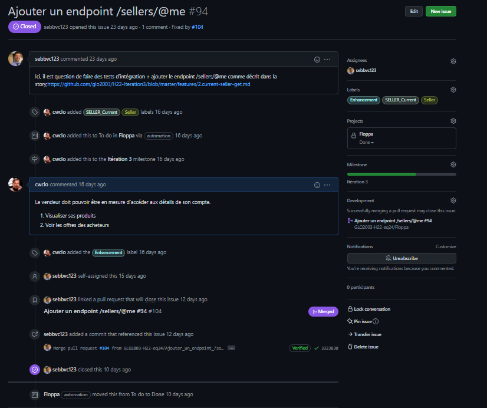
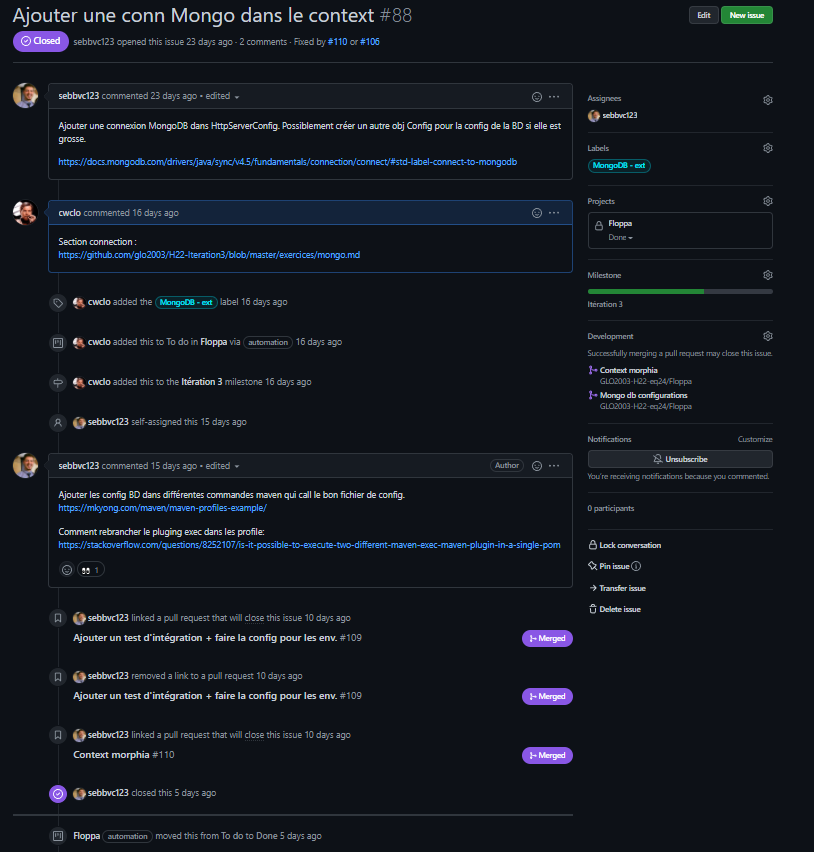

# TP3
# Planification du travail sur Github
## Project

## Milestone

## Issues

## Pull Request

## Arbre Commit

## Stratégie de commit
1. Avoir le nom de l'élément modifié/ajouté dans le nom des commits ou des branches
2. Garder les noms simple et court
3. Ne pas avoir trop de fichier édité pour facilier les review (impossible dans certains cas)
