# TP4
# Planification du travail sur Github


## Projet
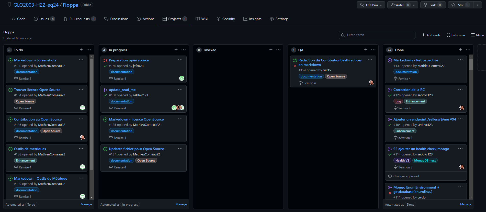
## Milestone
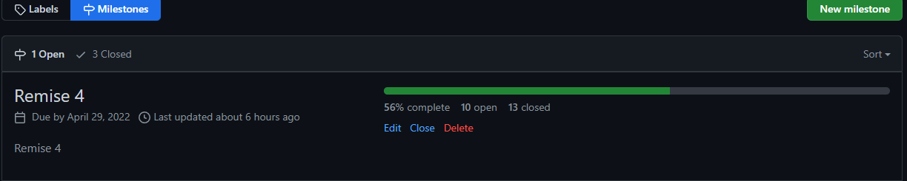
## Issues
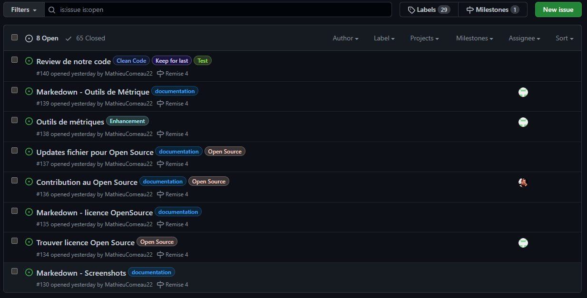
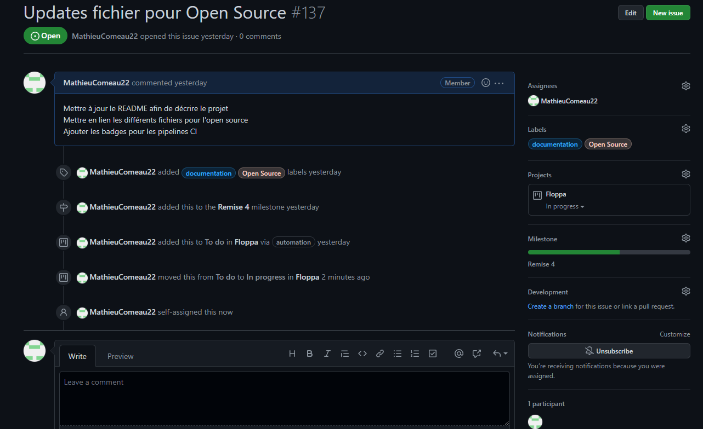
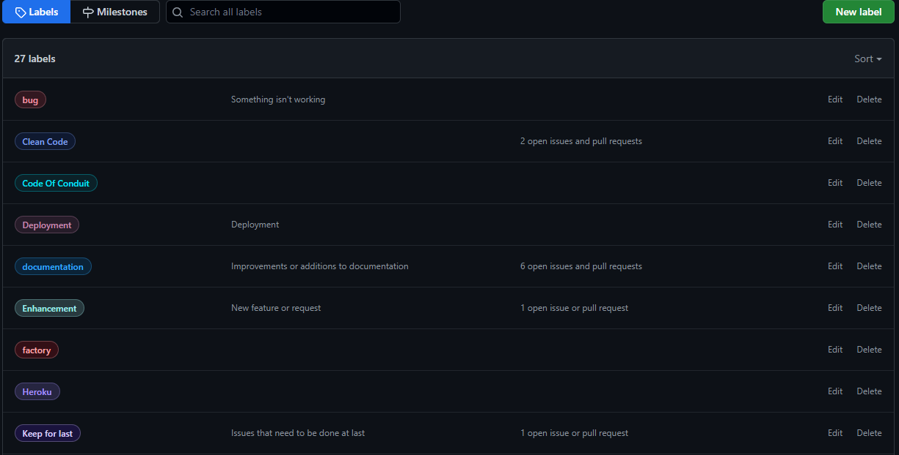
## PR
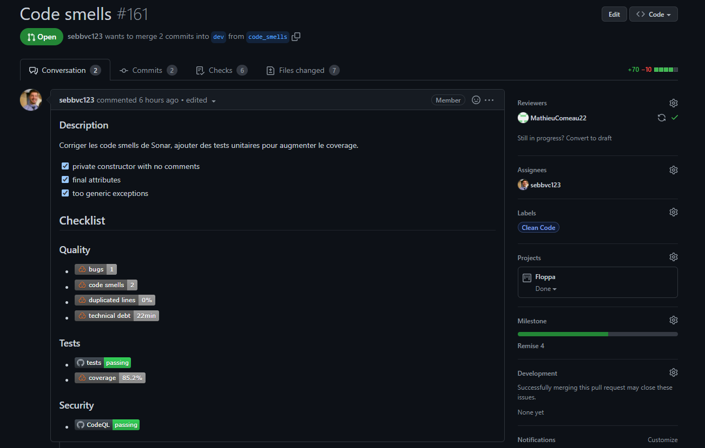
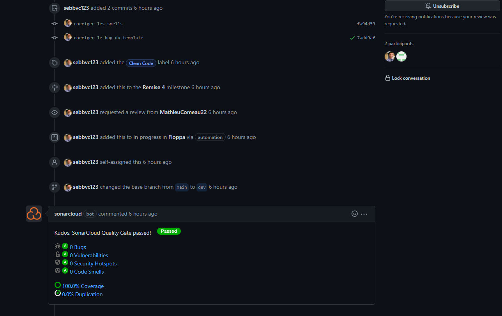
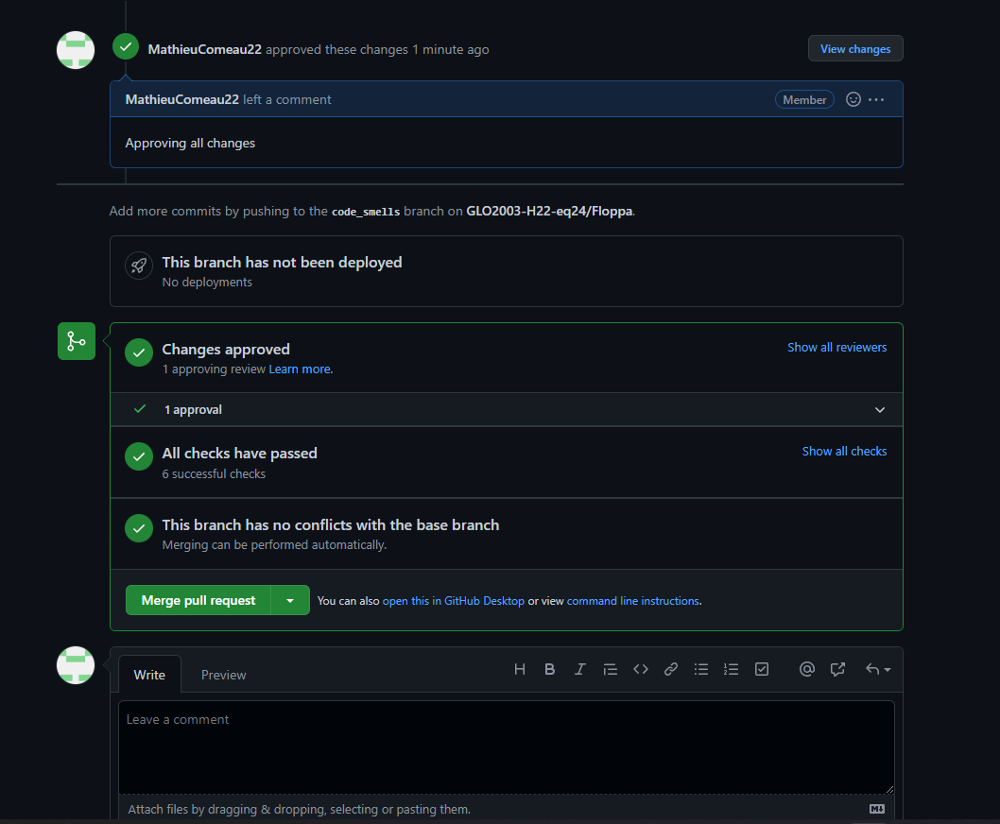
## Arbre de commits et de branches
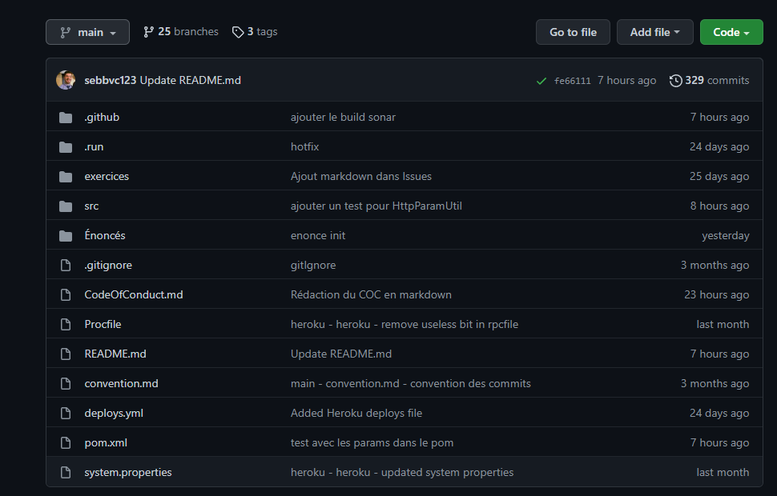

# Rétrospective finale

1. Décrivez 2 problématiques que possèdent votre processus et développer 2 plans distincts afin de les résoudres. Soyez constructifs dans vos critiques et évitez de mettre la faute sur une ou un groupe de personne en particulier.

    Nous avions une approche très agile pour le développement de Floppa, car nous étions une relativement petite équipe qui travaillait sur un projet de petite envergure. Par contre, nous avons tout de même négligé certaines parties importante du processus agile (surtout au début du projet).

    - Nous avons négligé grandement la phase de démarrage. Il y a donc eu un manque de planification de notre part et une architecture pas assez établie. Nous avons fait cela simplement parce que nous avions hate de commencer à implémenter (ce qui n'est pas mauvais en agile), mais il faut quand même s'assurer d'avoir une bonne base avant de commencer à coder.
    - Nous n'avons pas développé en TDD, ce qui a compliqué beaucoup de choses au cours du projet, comme l'intégration de plusieurs parties de code ainsi que l'ajout de nouvelles features. Nous étions simplement pas au courant des avantages qu'apportent le TDD (surtout au niveau de l'organisation du code) 
    <br></br>

2. Décrivez la démarche que vous aviez entrepris afin d'intégrer de nouveaux outils technologiques. Quelles étaient les étapes du processus? Comment avez-vous réagis aux différents bogues? Exploriez-vous à l'aide de tests unitaires ou manuels? Qu'avez-vous appris suite à cette démarche?

    - Notre mentalité pour la dernière itération du projet Floppa était de toujours y aller au plus simple. Nous avons donc essayé de trouver les outils directement sur git, pour ensuite aller voir un peu la documentation pour voir si l'intégration de l'outil au pipeline semble simple ou pas.  
    - Nous avons aussi jamais laissé une seule personne intégrer un outil seul. Nous nous sommes inspiré de la méthode agile XP (programmation en paire). 
    Cela nous a permis d'être encore plus sur de notre chois d'outils et cela a aussi facilité grandement le débugging
    - La chose qu'on retient le plus de notre expérience d'intégration d'outils, c'est le fait que le choix d'outil est très important. Certains outils peuvent sembler simple et efficace, mais ils ne réalisent pas ce qu'on souhaite. Il est donc très important de bien lire la documentation avant de commencer à intégrer.
    <br></br>

3. Quels sont les bons coups de votre équipe? De quelles parties êtes-vous fiers? Nommez-en 3.
    - Beaucoup de communication
    - On bon travail au niveau de la rigueur dans git
    - le respect des standards établis dans le contract d'équipe ainsi qu'au niveau de la programmtion
    <br></br>

4. Quel conseil donneriez-vous aux prochains étudiants qui doivent faire ce projet?

    - S'assurer d'établir une bonne architecture dès le départ. Cela va éviter beaucoup de problèmes d'intégration plus tard. Avoir une bonne fondation va aussi permettre aux étudiants de se retrouver facilement dans leur code, et leur donner la possibilité de "Keep It Stupid Simple".
    <br></br>
    
5. Quels apprentissages, trucs ou techniques appris dans ce projet croyez-vous pouvoir utiliser plus tard? Décrivez-en au moins 2. Cela peut être des apprentissages techniques, pratiques, sur le travail d'équipe ou encore par rapport au processus.

    - Avoir une gestion de Git demande beaucoup d'effort, mais ca en vaut la peine. 
    - Il est très important d'avoir une bonne ambiance d'équipe pour que le projet soit un succès. Il ne faut donc surtout pas négliger de travailler sur le coté communication du travaille en équipe. 
    <br></br>

# Open source

## Préparation

1. Une compagnie qui contribue à des projet open source obtient plusieurs bénéfices. Tout d'abord, si le projet est créé par la compagnie, les utilisateurs du projet seront en mesure d'aider à régler un bug lorsqu'ils en trouvent un.
Cela fait en sorte qu'il y aura moins d'effort nécessaires pour l'équipe de maintenance afin de garder le projet stable. Cela bénéficie à tous, car il y aura moins de problème avec le projet,
donc les utilisateurs seront plus satisfait avec le projet. Également, rendre le projet open source permet une plus grande adoption, ce qui peut être bénéfique pour l'entreprise, car cela amène
un nouvelle intérêt envers l'entreprise qui n'aurait pas été présent si le projet aurait été closed source. Dans le cas où le projet ne provient pas de l'entreprise, il est tout de même à son 
avantage de contribuer à ce type de projet, car elle pourrait simplement engager quelqu'un afin de faire des modifications à un projet qui existe déjà afin que celui-ci réponde plus aux besoins 
de l'entreprise au lieu de créer un nouveau projet closed source qui prendrait beaucoup plus de temps afin d'obtenir le même résultat.

2. Il est important de créer une bonne documentation afin que peu importe ce qu'une personne cherche, elle est en mesure de le trouver dans la documentation. Par exemple, il est important 
d'avoir un README afin que de nouveaux utilisateurs soient en mesure de savoir comment utiliser le projet. Un projet open source peut devenir trop grand pour l'équipe en place, cela peut 
causer plusieurs problèmes, car l'équipe ne serait pas en mesure de répondre à la quantité de demandes qui ne feraiewnt qu'augmenter au point de perdre le contrôle du projet. Il peut également
être difficile de gérer la partie légale d'un projet open source. Autant les dépendances que d'autres aspects du projet comme son nom doivent être grandment vérifier afin qu'il n'y est pas de
problèmes légaux liés à ceux-ci. Il faut également protéger le projet, mais cela ce fait bien plus facilement à l'aide d'une licence.

3. Nous avons été particulièrement surpris par la capacité que n'importe qui peut contribuer à un projet open source, peu importe leurs connaisances. Quelqu'un 
qui aime écrire peut aider un projet en écrivant de la documentation, quelqu'un qui aime la conception peut aider un projet avec sa conception afin de rendre le projet plus facile à utiliser,
quelqu'un qui aime planifier des événements peut aider en organsisant une conférence pour le projet afin qu'il soit plus connu, etc.

## Choix de la license: MIT License
- La license est permissive. Ca vveut donc dire qu'elle se caractérise par des exigences minimales sur la manière dont un logiciel peut être redistribué
- La license est très populaire. Étant donnée que c'est notre première fois qu'on "joue" avec le open source, on préfère prendre une license qui est populaire pour éviter les problèmes. 
- Il est possible d'intégrer la license MIT avec GPL, ce qui donne beaucoup de liberté au développeur propriétaire

## Exécution

# Outils de métriques

## Outil d'analyse de la qualité du code ET du test coverage: **SonarCloud**

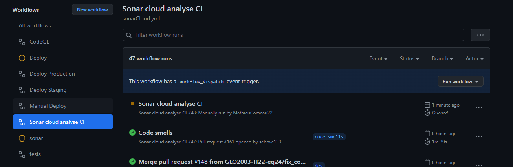
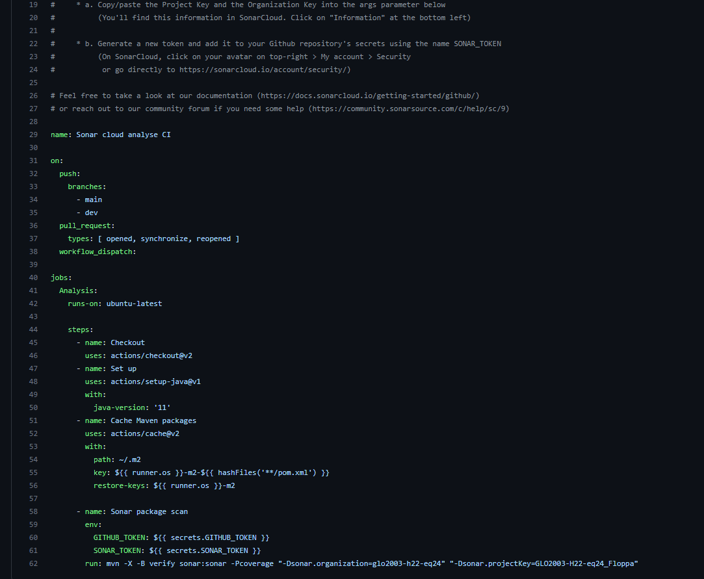

## outil de détection de failles de sécurité: **CodeQL**


# Story: Statistique 

##  Description
En tant que vendeur, je veux pouvoir ajouter une vue sur un produit afin de signaler l'intérêt pour ce produit ainsi que de visualiser cet intérêt.

##  Critères de succès
1. On peut incrémenter le nombre de vue pour un produit.
2. On peut visualiser le nombre de vue par produit. 
3. Le vendeur courant peut visualiser ses vues.

##  Détails techniques

### Requête ajouter view

#### *Route*
```
POST /products/{productId}/views
```

### Réponse status

- <code> 200 OK </code>

### Exceptions
 
- <code> ITEM_NOT_FOUND </code> si le produit n'existe pas.
- <code> MISSING_PARAMETER </code> si product ID est manquant (<code> null </code>).

### Requête voir views

#### *Route*
```
GET /products/@me 
```
 *Headers*
- <code> X-Seller-Id </code>: <code> String </code>
    - ID du vendeur

### Payload 
```javascript
[
    {
      productId: string,
      views: int,
    }
]
```

### Exemple de payload valide
```javascript
[
    {
        "productId": "7f12e673-4250-2177-91ec-7a675042607c",
        "views": 7
    },
    {
        "productId": "6f00e6b3-4250-4177-91ec-8b675042607c",
        "views": 8
    },

]
``` 

### Réponse status

- <code> 200 OK </code>

### Exceptions
 
- <code> ITEM_NOT_FOUND </code> si le seller Id n'existe pas.
- <code> MISSING_PARAMETER </code> si le seller Id est manquant (<code> null </code>).


